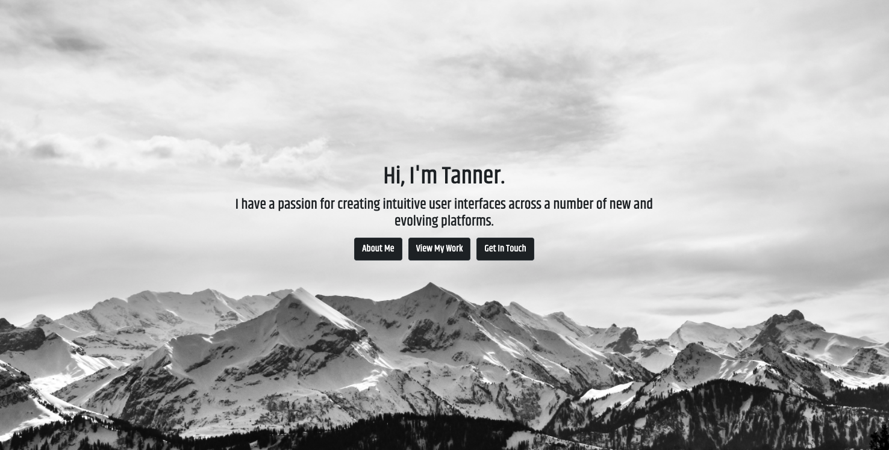
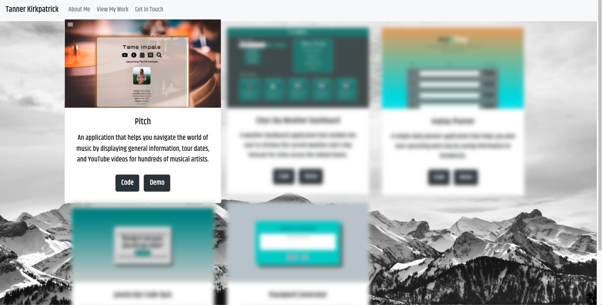
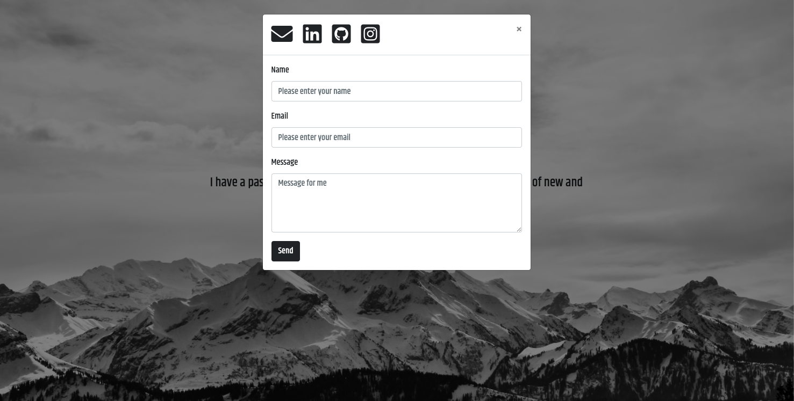
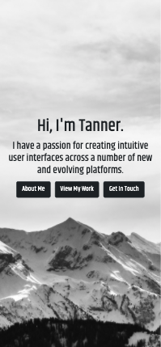
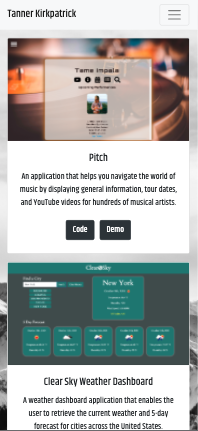
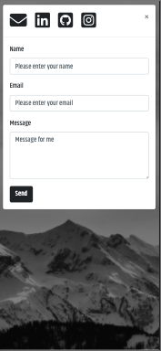

# Updated Portfolio
<a target="_blank" href="https://twkirkpatrick.github.io/">Deployed Portfolio</a>

For this assignment, I chose to completely revamp my original portfolio.  To get more practice with jQuery, I dynamically created most of the HTML.  Some new features include a functioning contact modal, CSS and JavaScript animations, as well as a minimalist interface.  As always, I took a mobile-first approach, ensuring that my portfolio is functional, accessible, and appealing on all screen sizes.

## Technologies
**HTML5**  
**CSS3**  
**JavaScript**  
**jQuery**  
**Bootstrap**

## Desktop

## Mobile

## Resources
**Font Awesome**  
**Google Fonts**  
**Animate.CSS**

### License & Copyright

Copyright &copy; Tanner Kirkpatrick 2020

